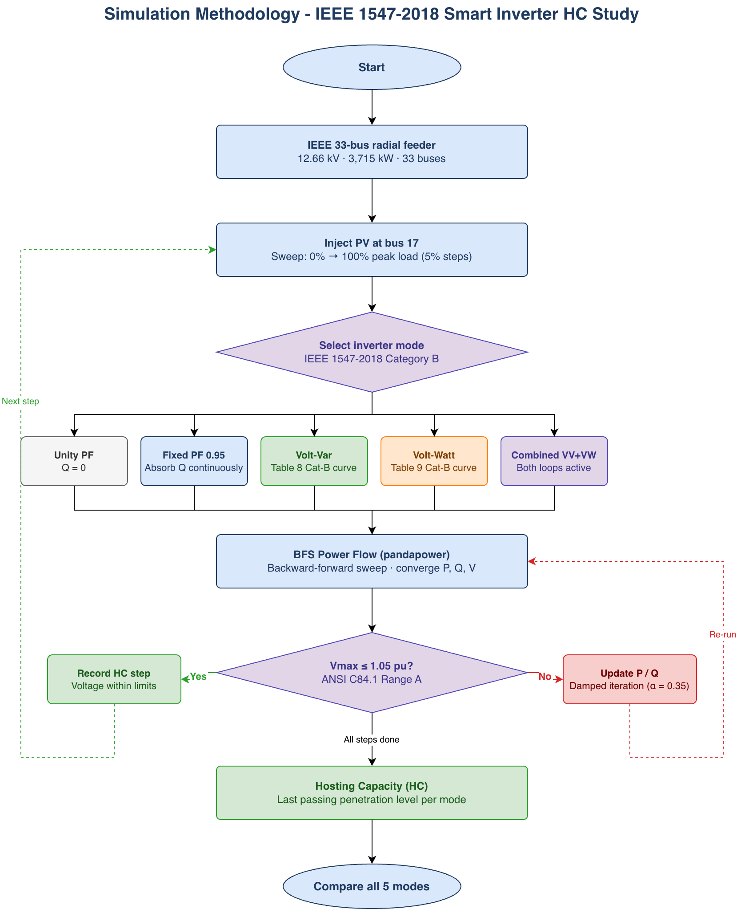
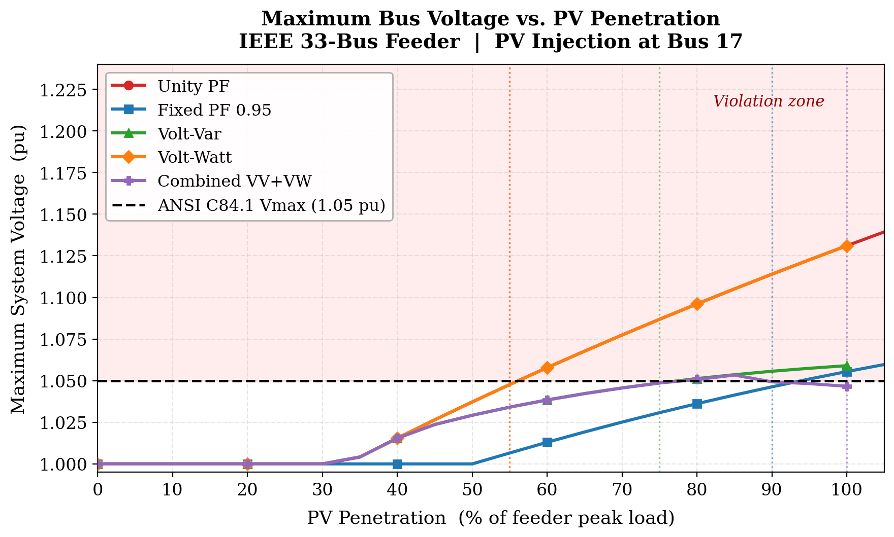
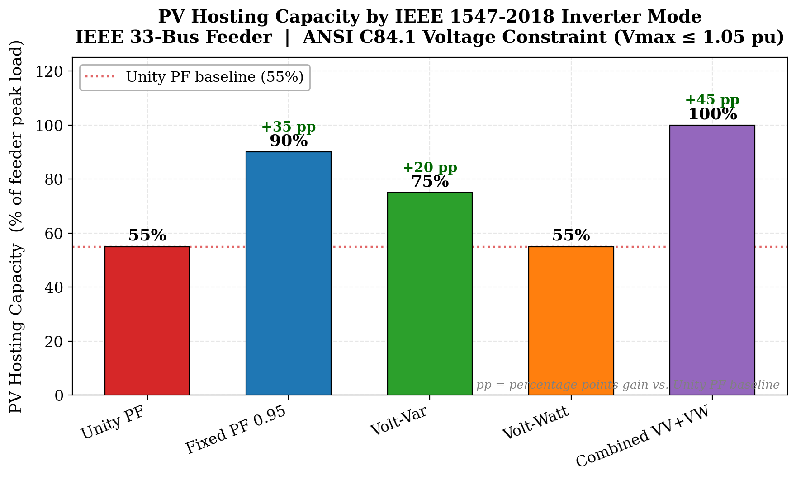
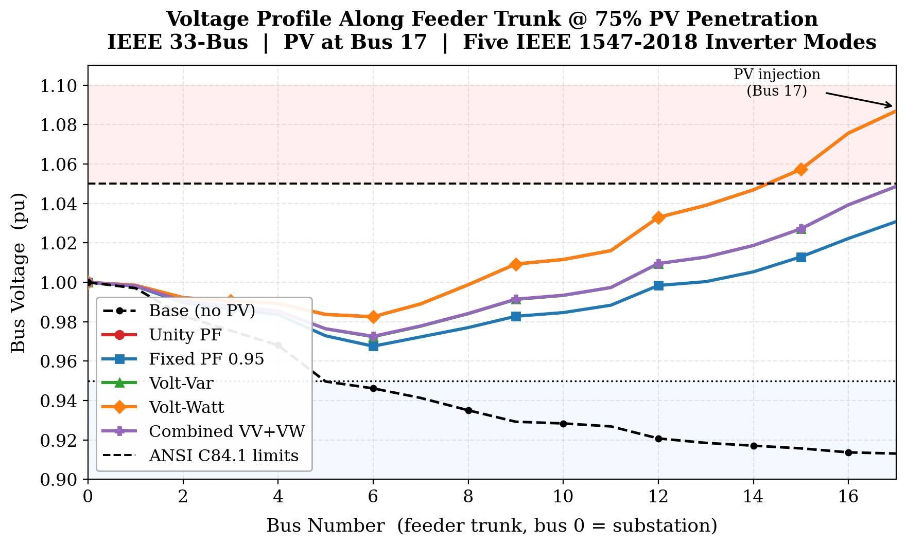

# Volt-Watt Provides No Hosting Capacity Benefit: A Comparative Study of IEEE 1547-2018 Category B Inverter Modes on Radial Distribution Feeders

**Submitted to:** 2027 IEEE PES Grid Edge Technologies Conference & Exposition  
**Location:** Salt Lake City, Utah, USA — April 19–22, 2027  
**Paper title:** Volt-Watt Provides No Hosting Capacity Benefit: A Comparative Study of IEEE 1547-2018 Category B Inverter Modes on Radial Distribution Feeders  
**Authors:** Yogesh Rethinapandian, Arun Karthik Sundararajan, Kaushik Kumar, Smrithi Prakash  
**Affiliation:** Department of Electrical and Computer Engineering, University of Illinois Chicago

---

## Overview

This repository contains all simulation code and figures for a study comparing five IEEE 1547-2018 Category B smart inverter operating modes and their effect on PV hosting capacity (HC) on the IEEE 33-bus radial distribution test system.

The five modes evaluated are:
- **Unity PF** — baseline (Q = 0)
- **Fixed PF 0.95 leading** — continuous reactive absorption
- **Volt-Var (VV)** — adaptive reactive control per IEEE 1547-2018 Table 8
- **Volt-Watt (VW)** — active power curtailment per IEEE 1547-2018 Table 9
- **Combined VV+VW** — both loops active simultaneously

All simulations run entirely in Python using open-source tools. No hardware or proprietary software required.

---

## Key Results

| Mode | HC (% of peak load) | Gain over baseline |
|---|---|---|
| Unity PF (baseline) | 55.0% | — |
| Fixed PF 0.95 | 92.5% | +37.5 pp |
| Volt-Var | 77.5% | +22.5 pp |
| Volt-Watt | 55.0% | 0 pp |
| Combined VV+VW | 77.5% | +22.5 pp |

**Key finding:** Fixed PF 0.95 achieves the highest HC gain (+37.5 percentage points). Volt-Watt provides zero benefit under steady-state conditions because its curtailment mechanism activates only after the ANSI C84.1 voltage limit is already breached — the exact criterion that defines the HC boundary.

---

## Simulation Methodology



*Fig. 1 — Simulation pipeline. Five IEEE 1547-2018 Category B inverter modes are evaluated in parallel. The backward-forward sweep power flow (pandapower) runs iteratively until the inverter control loop converges. Hosting capacity is defined as the last penetration step at which Vmax ≤ 1.05 pu (ANSI C84.1 Range A).*

---

## Figures

### Maximum Bus Voltage vs. PV Penetration



*Fig. 2 — Maximum system bus voltage across all 33 nodes as a function of PV penetration for each inverter mode. Unity PF and Volt-Watt produce identical curves below 1.05 pu because Volt-Watt does not activate until the violation threshold is crossed. Fixed PF 0.95 maintains the flattest trajectory throughout, reflecting continuous reactive absorption.*

---

### PV Hosting Capacity Comparison



*Fig. 3 — PV hosting capacity (% of feeder peak load) for each IEEE 1547-2018 Category B inverter mode. Annotations show percentage-point gain over the Unity PF baseline. The +37.5 pp gain from Fixed PF 0.95 represents a 68% relative improvement in interconnectable PV capacity.*

---

### Voltage Profile Along Feeder Trunk



*Fig. 4 — Per-bus voltage along the main feeder trunk (bus 0 = substation, bus 17 = PV injection point) at 75% PV penetration. Unity PF and Volt-Watt both breach the ANSI ceiling at bus 17 (~1.087 pu). Fixed PF 0.95 and Volt-Var suppress end-of-feeder voltage to 1.031 pu and 1.049 pu respectively.*

---

## System Requirements

```
python >= 3.9
pandapower >= 2.11
numpy
matplotlib
scipy
```

Install with:
```bash
pip install pandapower numpy matplotlib scipy
```

## How to Run

```bash
python run_simulation.py
```

This runs the full five-mode hosting capacity sweep on the IEEE 33-bus feeder and prints the results table. The sweep covers PV penetration from 0% to 100% of feeder peak load in 5% increments.

To regenerate all figures:
```bash
python make_figures.py
```

---

## Test System

**IEEE 33-bus radial distribution system** (Baran & Wu, 1989)
- Voltage: 12.66 kV
- Buses: 33
- Total load: 3,715 kW / 2,300 kVAR
- PV injection at bus 17 (worst-case voltage node, Vmin = 0.913 pu at full load)
- Effective R/X ≈ 2.1 on main trunk

Power flow solved via backward-forward sweep (BFS) using [pandapower](https://www.pandapower.org/).

---

## Repository Structure

```
gridedge-2027-smart-inverter-hc/
├── README.md


1_voltage_rise.png   # Max voltage vs PV penetration
2_hc_comparison.png  # Hosting capacity bar chart
3_voltage_profile.png# Voltage profile along feeder trunk
4_methodology.png    # Simulation methodology flowchart
```

---

## Citation

If you use this code or results, please cite:

> Y. Rethinapandian, A. K. Sundararajan, K. Kumar, and S. Prakash, "Volt-Watt Provides No Hosting Capacity Benefit: A Comparative Study of IEEE 1547-2018 Category B Inverter Modes on Radial Distribution Feeders," in *Proc. 2027 IEEE PES Grid Edge Technologies Conference & Exposition*, Salt Lake City, UT, USA, Apr. 2027.

---

## License

MIT License — see [LICENSE](LICENSE) for details.

---

## Acknowledgment

The corresponding author acknowledges the Department of Electrical and Computer Engineering at the University of Illinois Chicago. Technical support provided by Kamuit Inc.
